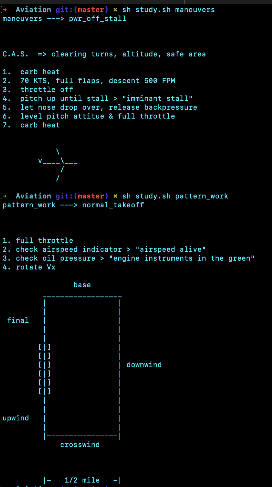

Use this repo to study your pattern work, manouvers, and other (coming soon) single engine land private pilot material. 

to get started just choose which directory you would like to stduy from and run 
`sh study.sh maneuvers` 
or 
`sh study.sh pattern_work`

example: 

